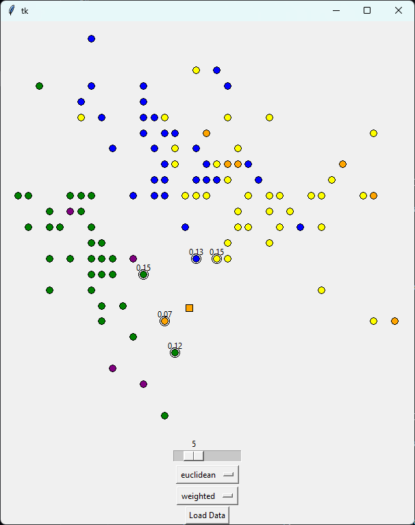

<div align="center">
  <h1 align="center">k-NN</h1>
  <h3>The open-source k-NN visualization tool.</h3>
</div>

<br/>

<div align="center">
  <a href="https://github.com/emilgruzalski/k-NN/blob/main/LICENSE.txt"></a>
</div>

<br/>

k-NN is the open-source k-nearest neighbors algorithm visualization tool with interactive GUI.

## Features

- **Load Data:** Import data from a CSV file for processing
- **Data Normalization:** Scale data to the range [0, 1]
- **Neighbor Selection:** Determine the number of nearest neighbors (k)
- **Distance Metric:** Choose between Euclidean or Manhattan metrics
- **Voting Method:** Opt for either simple or weighted voting
- **Real-Time Visualization:** Visualize points and classify data in real-time

## Demo



## Tech Stack

- [tkinter](https://docs.python.org/3/library/tkinter.html) – GUI Framework
- [Python](https://www.typescriptlang.org/) – Language
- [pandas](https://pandas.pydata.org/) – Data analysis
- [SciPy](https://scipy.org/) - Mathematical algorithms
- [pytest](https://docs.pytest.org/en/8.2.x/) - Test Framework

## Getting Started

### Prerequisites

Here's what you need to be able to run k-NN:

- Python (version >= 3.12)

### 1. Clone the repository

```shell
git clone https://github.com/emilgruzalski/k-NN.git
cd k-NN
```

### 2. Create virtual environment

```shell
python -m venv .venv
```

### 3. Activate virtual environment

```shell
source .venv/bin/activate
```

### 4. Install pip dependencies

```shell
pip install -r requirements.txt
```

### 5. Run the app

```shell
cd app
python main.py
```

## Tests

To run tests, follow these steps:

### 1. Run the test

```shell
cd tests
pytest test.py
```
